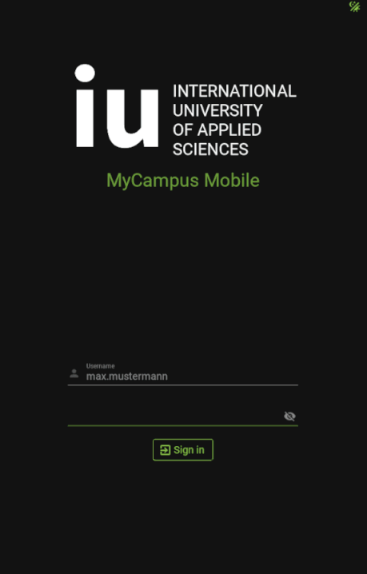
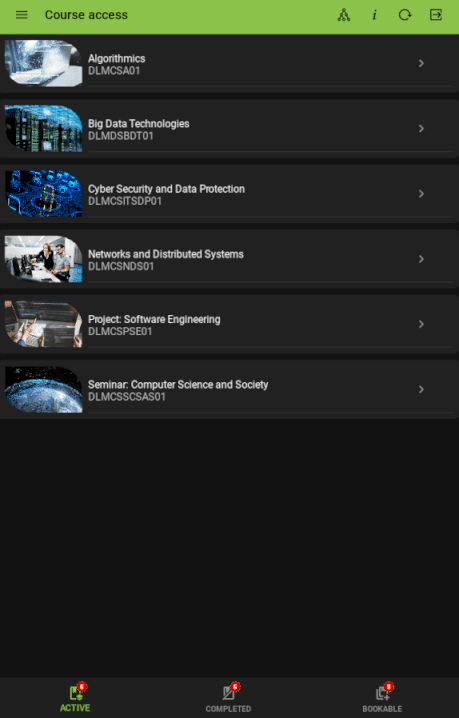
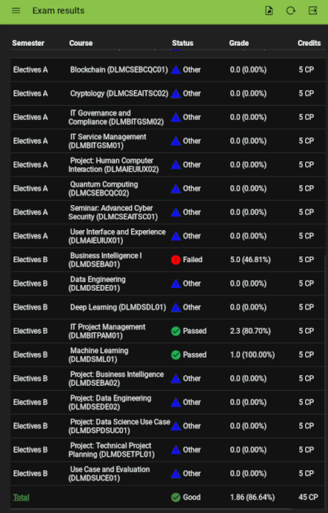

# MyCampusMobile

Software Engineering Project for IU (www.iu-fernstudium.de)

**MyCampusMobile** aims to provide seamless access to [*MyCampus*](https://mycampus.iubh.de/) on personal mobile device by porting available functions and extending available interfaces to enable purposeful user experience.

Project targets the [*Android 11*](https://developer.android.com/about/versions/11) platfrom and utilizes [*Buildozer*](https://buildozer.readthedocs.io/en/latest/) for packaging.

## Contents

- [Features](#features)
- [Show Cases](#show-cases)
- [Deployment](#deployment)
- [Testing](#testing)
- [Unresolved issues](#unresolved-issues)

## Features
- [x] Sign-In & Sign-Out
- [x] Listing available & completed course modules
- [x] Downloading course resources
- [x] Booking course modules (**experimental!!!**)
  - [x] Enrolling in course modules
  - [x] Starting course modules
  - [x] Show available credit points
  - [ ] Rendering dependency graph (**desktop only!!!**)
  - [ ] Exporting dependency graph as PNG (**desktop only!!!**)
- [x] Exam results
  - [x] Browser
  - [x] Editor & Calculator
- [x] Calendar view (recent & upcoming)
  - [x] Month view
  - [x] Interaktive event browser
  - [x] Event filtering
  - [x] iCal export
- [x] Theme switcher
  - [x] Dark mode
  - [x] Light mode (**experimental!!!**)

## Show Cases

### Secure Sign-In

[](https://github.com/sarumaj/MyCampusMobile)

### Course Management

[](https://github.com/sarumaj/MyCampusMobile)

### Exam Results Access

[](https://github.com/sarumaj/MyCampusMobile)

### Calendar Access

[](https://github.com/sarumaj/MyCampusMobile)

## Deployment

Install [**Buildozer**](https://buildozer.readthedocs.io/en/latest/) according to the installation instructions [here](https://buildozer.readthedocs.io/en/latest/installation.html).

Building Android Package (apk).

```bash
git clone https://github.com/sarumaj/MyCampusMobile
cd MyCampusMobile
make debug
```

Building Android App Bundle (aab).

```bash
git clone https://github.com/sarumaj/MyCampusMobile
cd MyCampusMobile
make release
```

## Testing

Initialize mock environment.
In order to set up a mock environment, a _valid MyCampus student account_ is required!!!

```bash
git clone https://github.com/sarumaj/MyCampusMobile
cd MyCampusMobile
make dump
```

Run from mock environment.

```bash
git clone https://github.com/sarumaj/MyCampusMobile
cd MyCampusMobile
make test
```

## Unresolved issues

- [Matplotlib: shared libc++](https://github.com/sarumaj/MyCampusMobile/issues/1)
- [AsyncImage TLS issue](https://github.com/sarumaj/MyCampusMobile/issues/2)
